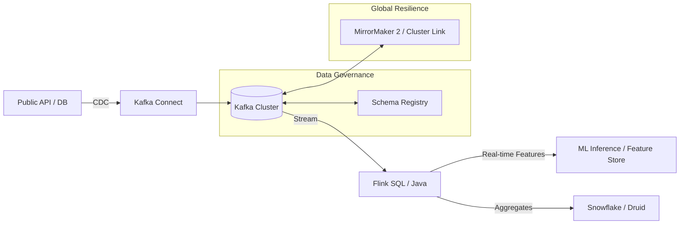

# 🌪️ Streaming Mastery: From Kafka to Real-time Hero

The ultimate repository for mastering the Confluent stack, Apache Kafka internals, and Real-time Stream Processing with Apache Flink.

---

## 🚀 The Mastery Path

### 📍 [Level 1: Broker Tuning](./01-broker-tuning)
*   **Focus**: Durability and Throughput.
*   **Concepts**: ISR Tuning, Partition Sizing, KRaft vs Zeeper.

### 🚨 [Level 2: Consumer Lag](./02-consumer-lag-handling)
*   **Focus**: Scalability.
*   **Concepts**: Backpressure, Poison Pills (DLQ), Consumer Rebalancing.

### 🧬 [Level 3: Schema Registry](./03-schema-registry)
*   **Focus**: Data Governance.
*   **Concepts**: Avro/Protobuf evolution, Backward/Forward Compatibility.

### 🔌 [Level 4: Kafka Connect](./04-kafka-connect)
*   **Focus**: Ecosystem Connectivity.
*   **Concepts**: CDC (Change Data Capture), SMTs, DLQ patterns.

### 🔄 [Level 5: Disaster Recovery](./05-disaster-recovery)
*   **Focus**: Global Resilience.
*   **Concepts**: MirrorMaker 2, Cluster Linking, Offset Replay.

### ⚡ [Level 6: Flink Real-time](./06-flink-realtime)
*   **Focus**: Advanced Event Processing.
*   **Concepts**: Flink SQL, Watermarks, Event-time processing, State Management.

---

## 📚 Special Mastery Guides

- **[🎯 Streaming CLI Cheatsheet](./STREAMING_CLI_CHEATSHEET.md)**: Kafka, Confluent, and Flink commands at your fingertips.
- **[🧠 Senior Interview Guide](./SENIOR_STREAMING_INTERVIEW_GUIDE.md)**: 50+ deep-dive concepts on Zero-copy, Segment files, and production scenarios.

---

## 🧠 Data Flow Architecture (Real-time AI)

---

### humanized-note
> "In high-scale systems, the difference between a mess and a masterpiece is in the backpressure handling and schema evolution. This repo is built for the engineers who build the backbones of the modern digital world."

Made with ❤️ for the Streaming community.
